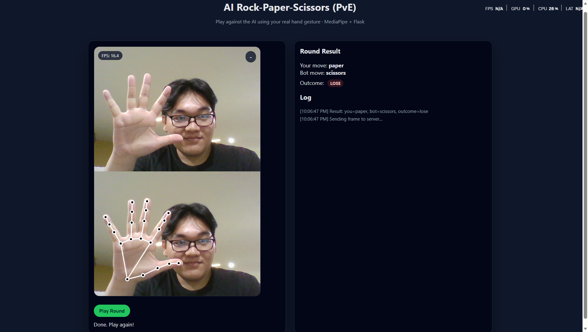

# Real-time AI Rock-Paper-Scissors (PvE Version)



## 📌 Overview

This project is a **real-time Rock--Paper--Scissors game** that uses
**AI (MediaPipe Hands + Python)** to recognize your hand gesture via
webcam.\
You play **against a bot (PvE)** --- no Socket.IO, no multiplayer.

------------------------------------------------------------------------

## 🚀 Features

-   Real-time webcam capture (MediaPipe JS)
-   On-screen skeleton hand visualization
-   Rule-based gesture detection (Server-side)
-   AI bot decision logic (randomized)
-   FPS display on UI
-   Flask backend + MediaPipe Python inference
-   Clean UI, ready for deployment

------------------------------------------------------------------------

## 🧠 Tech Stack

### **Frontend**

-   HTML / CSS / JavaScript
-   MediaPipe Hands (JavaScript)
-   MediaPipe Drawing Utils
-   Canvas API

### **Backend**

-   Python Flask
-   MediaPipe (Python)
-   OpenCV
-   NumPy

------------------------------------------------------------------------

## 📂 Project Structure

    project/
    │── app.py
    │── README.md
    │── /templates
    │     └── index.html
    │── placeholder.png   ← placeholder image for documentation

------------------------------------------------------------------------

## ▶️ How to Run

``` bash
pip install -r requirements.txt
python app.py
```

Then open:

    http://127.0.0.1:5000/

------------------------------------------------------------------------

## 📸 Placeholder Image

A placeholder image (`placeholder.png`) is included for documentation or
diagram replacement.\
Replace it later with your architecture diagram.

------------------------------------------------------------------------

## 📝 Todo (Placeholders)

-   [ ] Add architecture diagram\
-   [ ] Add demo screenshots\
-   [ ] Add deployment instructions\
-   [ ] Add model improvement notes

------------------------------------------------------------------------

## 🧑‍💻 Author

Your Name\
FPT University -- AI / Software Engineering

------------------------------------------------------------------------

## 📄 License

MIT License\
Feel free to use, modify, and ship!
